# native apps intro [link](https://training.snowflake.com/lmt/clmsCourseDetails.prMain?in_offeringid=194713824&in_sessionid=224532343080453J&in_from_module=CLMSBROWSEV2.PRMAIN&in_lp_id=0&in_filter=)

* snowflake app deployment model 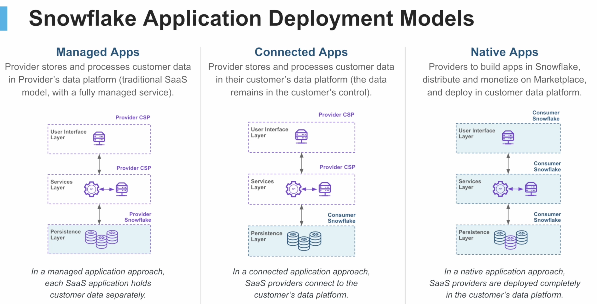
- managed apps 
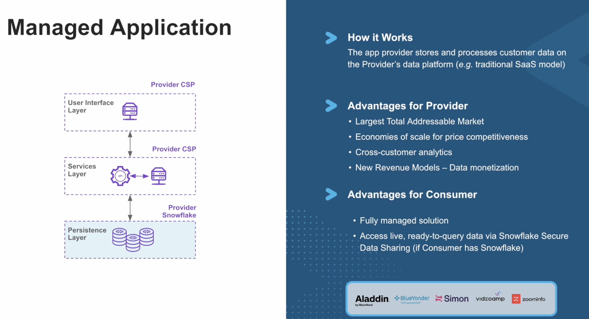
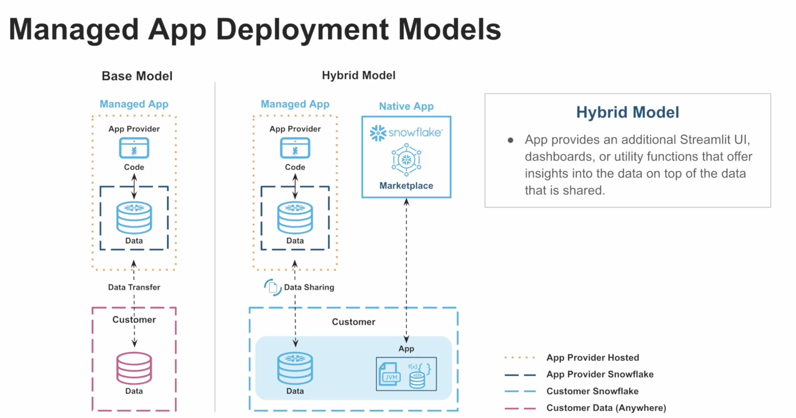

- connected apps
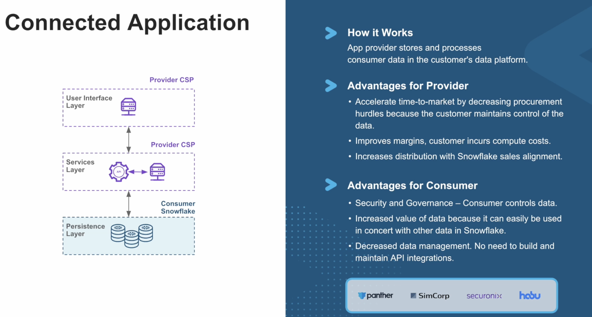
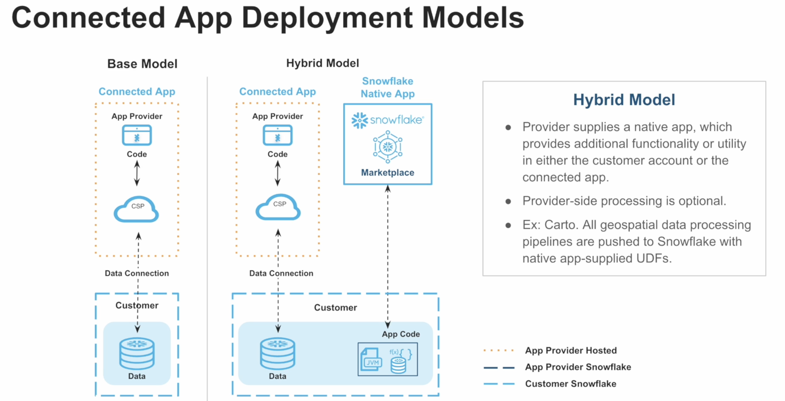

- native apps
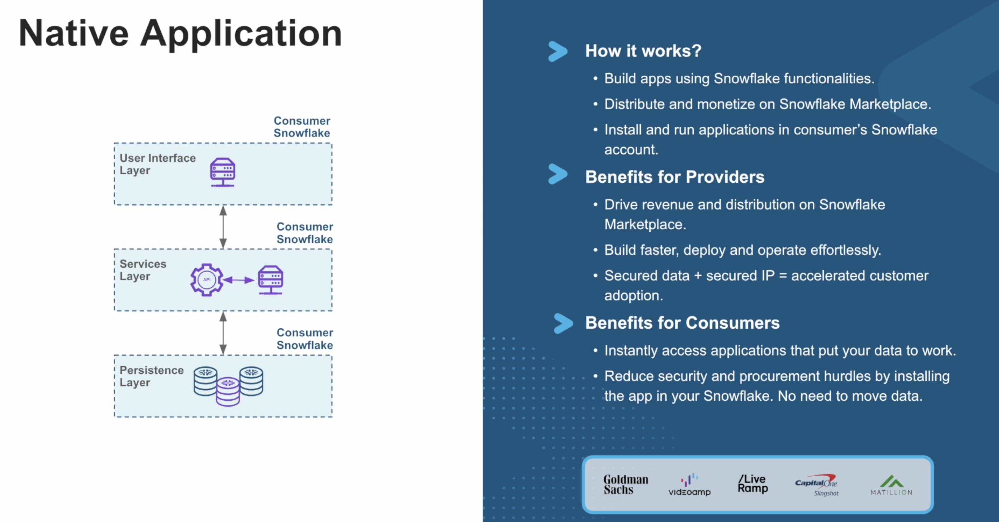
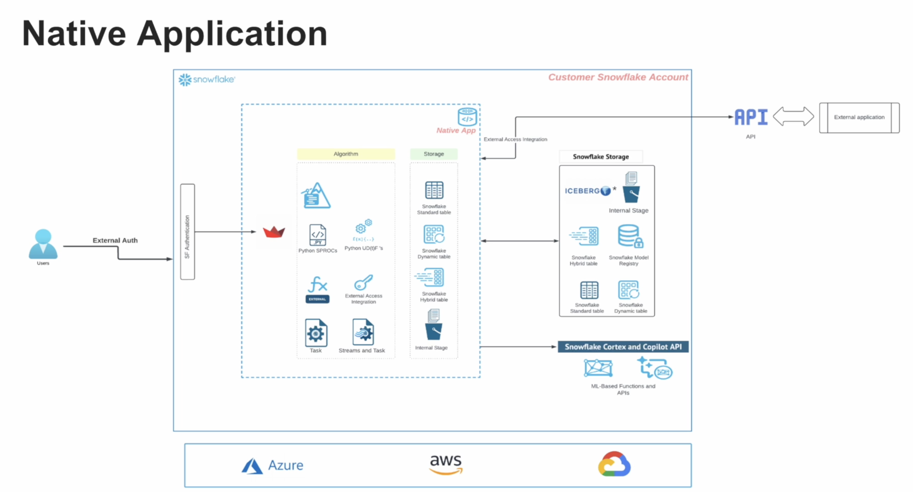
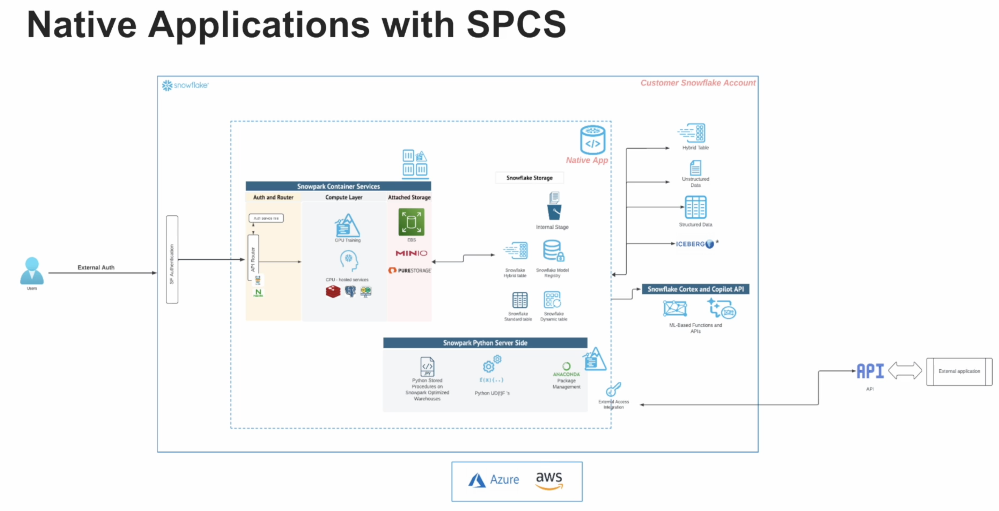

- model sharing with spcs and gpu
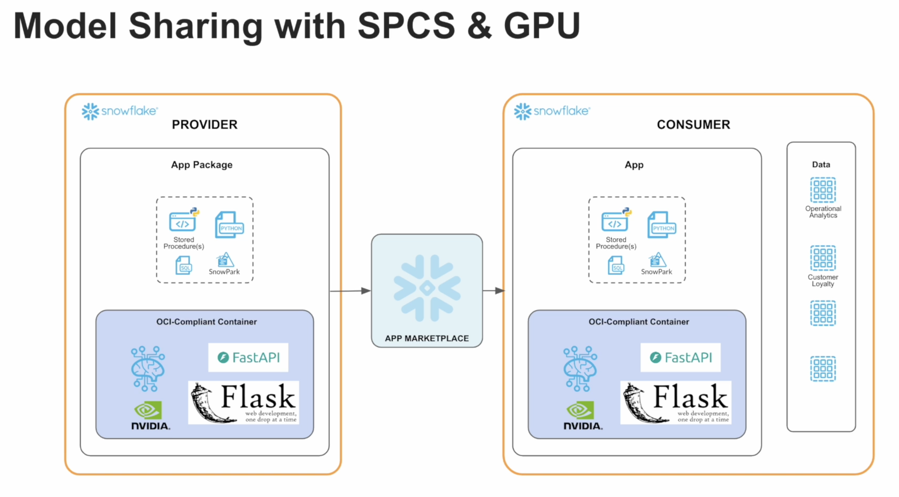

* recomendations for native apps. Do: 
- health check 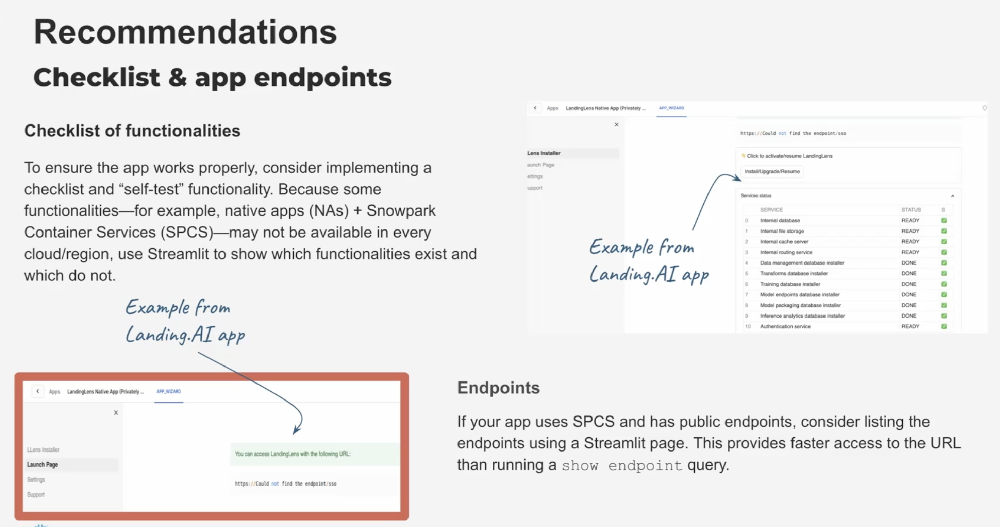
- doc 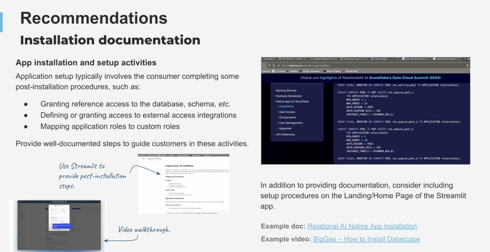
- diagram 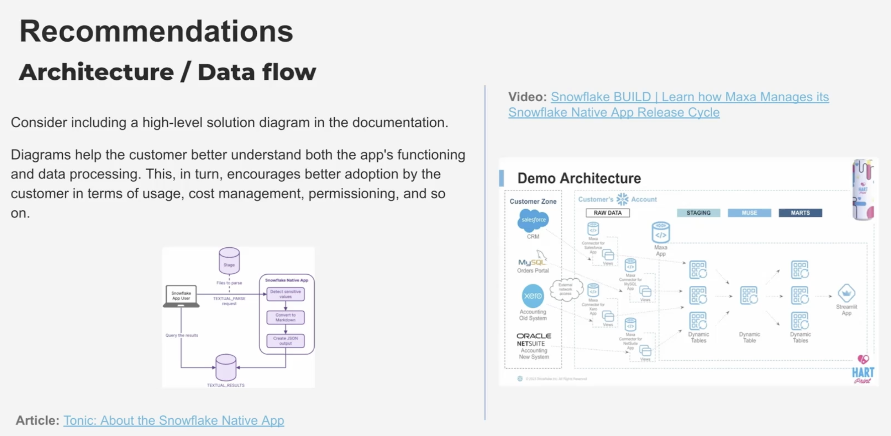
- health check 
- application roles 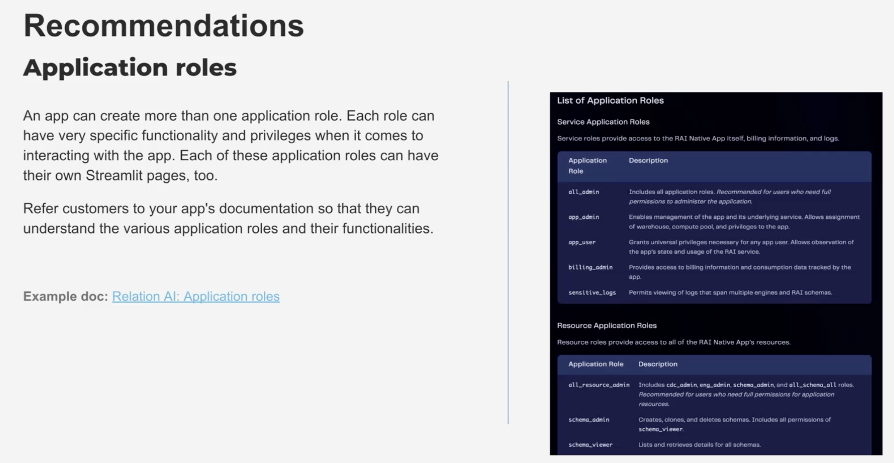
- cost management 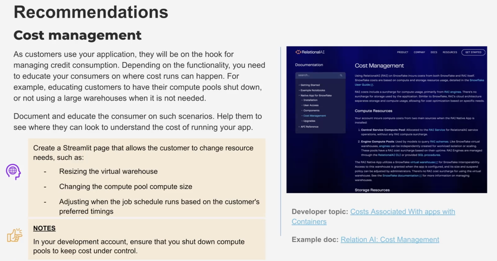
- sample data 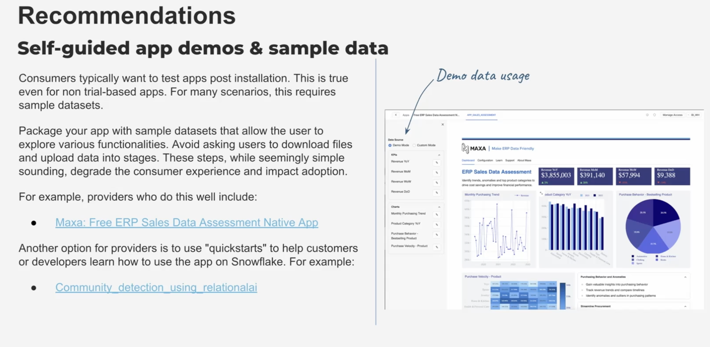
- provider and external api endpoint 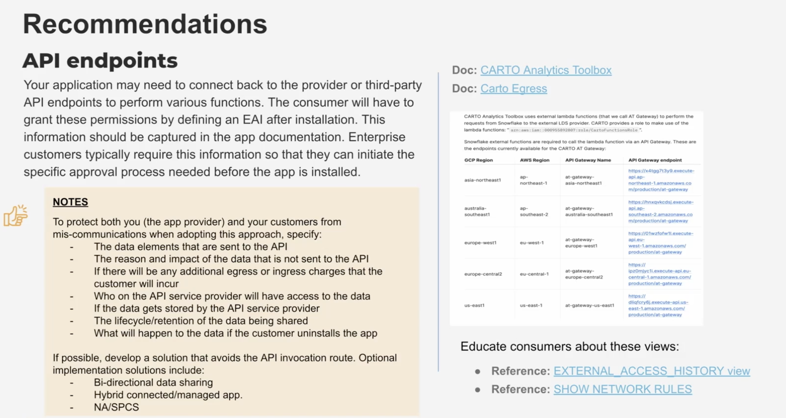
- security review 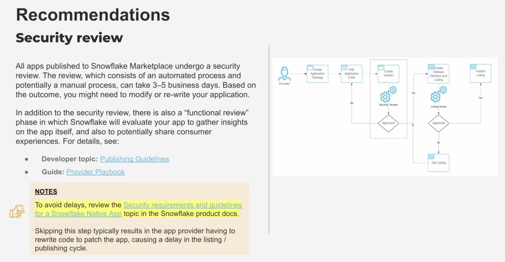
- usage and insights 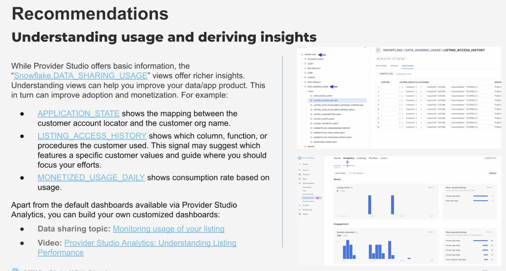
